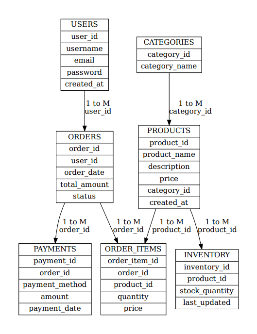
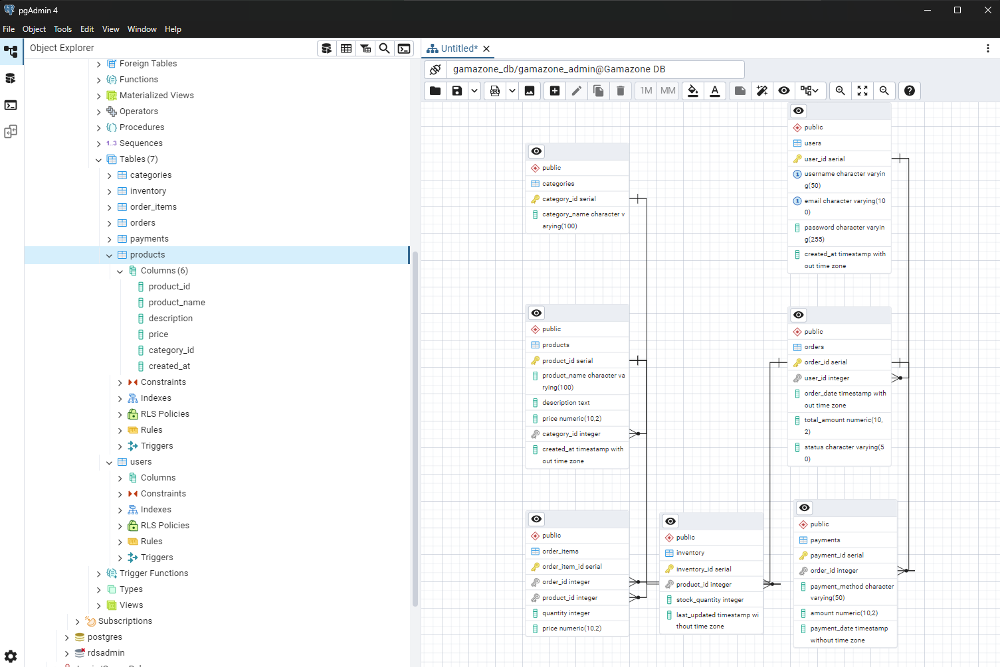

# 🎮 Gamazone - Database Management with Amazon RDS and PostgreSQL
This is a demonstration of a sample project which manages the PostgreSQL database for the **Gamazone e-commerce platform**, hosted on **Amazon RDS**. It includes the initial schema setup, sample data insertion, backup/restore procedures, Multi-AZ configuration, and secure access control.

---

## 📚 Content Overview

- [ Project Overview](#-project-overview)
- [1. Creating a PostgreSQL Database in Amazon RDS](#-creating-a-postgresql-database-in-amazon-rds)
- [2. Basic Schema Setup (`gamazone_schema.sql`)](#-basic-schema-setup-gamazone_schemasql)
- [3. Sample Data Insertion (`sample_dataset.sql`)](#-sample-data-insertion-sample_datasetsql)
- [4. Setting Up pgAdmin](#-setting-up-pgadmin)
- [5. Backup and Restore Procedures](#-backup-and-restore-procedures)
- [6. Increasing Availability with Multi-AZ](#-increasing-availability-with-multi-az)
- [7. Setting Up Access Control](#-setting-up-access-control)

---

## 🎯 Project Overview
**Gamazone** is an online platform that sells gaming consoles, games, and accessories. This project simulates the backend using Amazon RDS with PostgreSQL.

### 📂 Quick Reference

- **Database Name:** `gamazone_db`
- **Master Username:** `gamazone_admin`
- **Project Path:** `D:/awsprojects/gamazone-db-maintenance/`
- **RDS Endpoint:** `gamazone-db-instance.c9m8q0yekuoq.us-east-2.rds.amazonaws.com`
- **SQL Files:**
  - `${PROJECT_PATH}gamazone_schema.sql` – Contains the database schema.
  - `${PROJECT_PATH}sample_dataset.sql` – Inserts sample data for testing.

---

## 🚀 1. Creating a PostgreSQL Database in Amazon RDS

### ✅ Step 1: Create a Database in Amazon RDS
1. **Open RDS Console:**
   - Go to [AWS Management Console](https://aws.amazon.com/console/).
   - Search for `RDS` and click on **RDS**.

2. **Create a New Database:**
   - Click on **Create Database**.
   - Choose **PostgreSQL** as the engine.
   - Select **Production** template (recommended).
   - Enable **Multi-AZ** for high availability.
   - Configure DB details:
     - DB Name: `gamazone_db`
     - Master Username: `gamazone_admin`
     - Master Password: Choose a secure password.
   - Click **Create Database**.

---

## 📚 2. Basic Schema Setup (`gamazone_schema.sql`)

Now you can connect to the RDS databse from your local computer through a Command Line Interface or Pgadmin. 
Get Endpoint : Go to the RDS Dashboard and select your newly created database. Copy the endpoint URL.

### ✅ Step 1: Connect to the Database
```bash
psql -h ${RDS_ENDPOINT} -U gamazone_admin -d gamazone_db
```

### ✅ Step 2: Run the Schema
```bash
\i ${PROJECT_PATH}gamazone_schema.sql
```

### ✅ Step 3: Verify Tables
```bash
\dt
```


---

## 📄 3. Sample Data Insertion (`sample_dataset.sql`)

### ✅ Step 1: Insert Sample Data
```bash
psql -U gamazone_admin -d gamazone_db -f ${PROJECT_PATH}sample_dataset.sql
```

### ✅ Step 2: Verify Inserted Data
```bash
SELECT * FROM users;
SELECT * FROM products;
```

---

## 🎨 4. Setting Up pgAdmin

### ✅ Step 1: Download and Install pgAdmin
1. Go to the [pgAdmin Download Page](https://www.pgadmin.org/download/).
2. Download and install for your operating system.
3. Follow the setup instructions.

### ✅ Step 2: Create a New Server
1. Open pgAdmin and right-click on **Servers**.
2. Select **Create** → **Server**.
3. In the **General** tab:
   - **Name:** `Gamazone Database`

### ✅ Step 3: Configure Connection Settings
- **Host name/address:** `${RDS_ENDPOINT}`
- **Port:** `5432`
- **Maintenance Database:** `gamazone_db`
- **Username:** `gamazone_admin`
- **Password:** Your master password.



---

## 🔒 5. Backup and Restore Procedures

### 📚 Method 1: Manual Snapshots
1. **Open RDS Console:**
   - Go to **RDS Console**.
   - Select your DB instance.
2. **Take Snapshot:**
   - Click **Actions** → **Take Snapshot**.
   - Provide a name and click **Create Snapshot**.

---

### 📚 Method 2: Automate Backups with AWS Backup

#### ✅ Step 1: Create a Backup Vault
1. Go to **AWS Backup Console**.
2. Click **Backup Vaults** → **Create Backup Vault**.
3. Name the vault `rds-backup-vault`.

#### ✅ Step 2: Define Backup Plan
1. Click **Create Backup Plan**.
2. Add a rule for daily/weekly backups.
3. Assign the backup plan to the RDS instance.

---

## ⚡️ 6. Increasing Availability with Multi-AZ

### ✅ Option 1: Enable Multi-AZ During Creation
- In the **Availability & Durability** section, select **Multi-AZ DB Instance**.

### ✅ Option 2: Modify an Existing Instance
1. Open **RDS Console**.
2. Select the DB instance.
3. Click **Modify**.
4. Enable **Multi-AZ** under **Availability & Durability**.
5. Apply changes immediately or during the next maintenance window.

---

## 🔐 7. Setting Up Access Control

### 🔒 Method 1: Create IAM Users and Groups for RDS Access
1. Go to **IAM Console**.
2. Create IAM users and assign them to groups.
3. Attach `AmazonRDSFullAccess` or `AmazonRDSReadOnlyAccess` policies.

---

### 🔒 Method 2: Set Up Database-Level Access Control

#### ✅ Step 1: Connect to the Database
```bash
psql -h ${RDS_ENDPOINT} -U gamazone_admin -d gamazone_db
```

#### ✅ Step 2: Create Application-Specific Users
```sql
CREATE ROLE app_user WITH LOGIN PASSWORD 'strong_password';
GRANT CONNECT ON DATABASE gamazone_db TO app_user;
```

#### ✅ Step 3: Grant Required Privileges
```sql
GRANT SELECT, INSERT, UPDATE ON ALL TABLES IN SCHEMA public TO app_user;
```

---

## 💡 Conclusion
This project demonstrates a basic end-to-end PostgreSQL database management setup on Amazon RDS with secure access control, high availability using Multi-AZ, and backup automation with AWS Backup.
